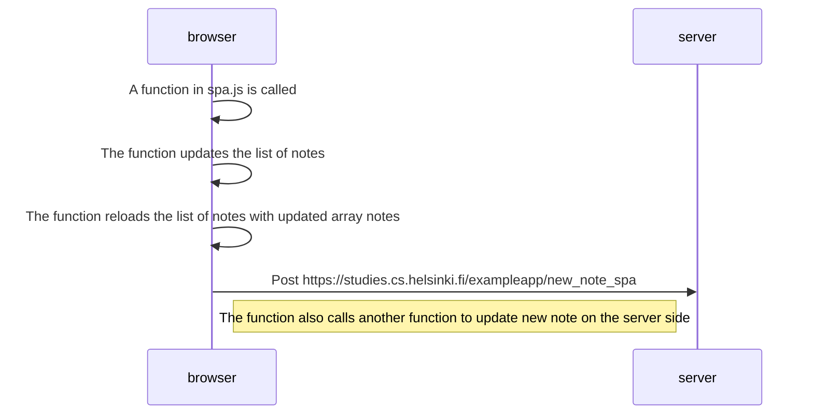

The diagram depicting the situation where user adds a new note in https://studies.cs.helsinki.fi/exampleapp/spa (single-page app)

```mermaid
sequenceDiagram
    participant browser
    participant server

    browser->>browser: A function in spa.js is called

    browser->>browser: The function updates the list of notes 
    browser->>browser: The function reloads the list of notes with updated array notes

    browser->>server: Post https://studies.cs.helsinki.fi/exampleapp/new_note_spa
    Note right of browser: The function also calls another function to update new note on the server side
```